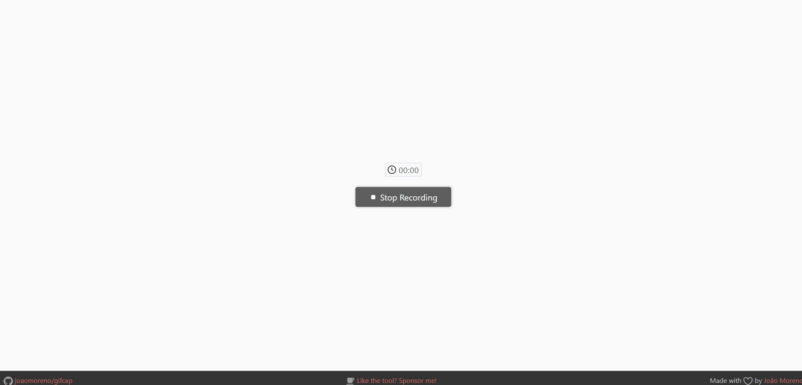
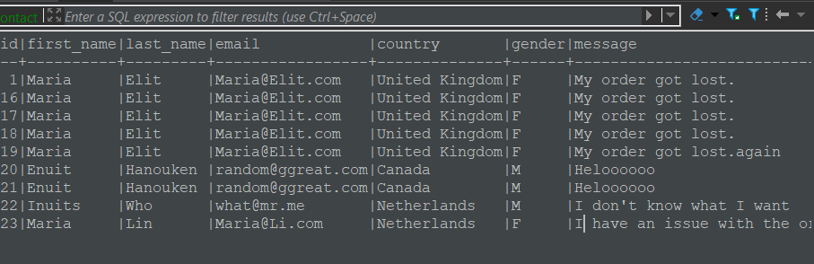

# Project: Form in Python with Flask

## Problem statement:
The company Hackers Poulette™ sells DIY kits and accessories for Rasperri Pi. They want to allow their users to contact their technical support. Your mission is to develop a Python script that displays a contact form and processes its response: sanitization, validation, and then sending feedback to the user.

## Objectives:
* Backend: PYTHON programming (introduction to logical structures)
* Sanitization and validation of a form
* Implementation of POST and GET methods
* Implementation of templates with Jinja
  
  And I went a bit further:

* Implementation of a honeypot anti-spam technique
* Used MariaDB to store the data
* Used Flask to create the server
* Used DBeaver to manage the database

* If the user makes an error, the form should be returned to them with valid responses preserved in their respective input fields.
* Ideally, display error messages near their respective fields.
* The form will perform server-side sanitization and validation.
* If sanitization and validation are successful, a "Thank you for contacting us." page will be displayed, summarizing all the encoded information.
* Implementation of the honeypot anti-spam technique.
* The form will be stored in a database.
  
## Website

## Database (MariaDB)
